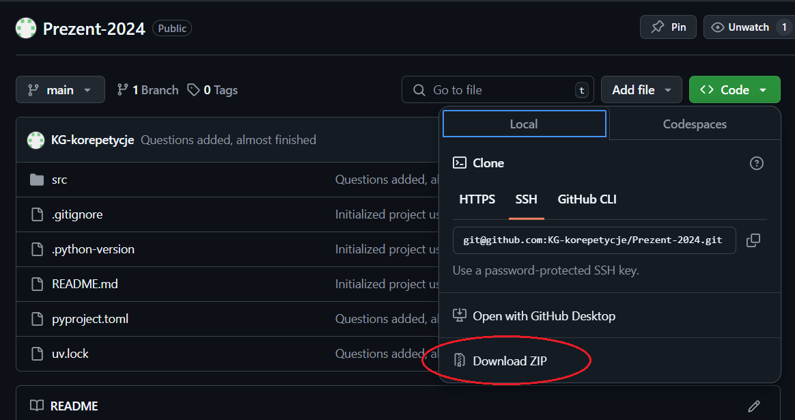

# Prezent świąteczny dla Antka - edycja 2024 :santa:

### Instrukcja
W tym repozytorium znajdują się pliki niezbędne do otrzymania prezentu.

Aby go zdobyć należy:
- pobrać te pliki do siebie na komputer. Najłatwiej nacisnąć zielony przycisk `<> Code` i po rozwinięciu menu wybrać na dole *Download ZIP* (jak na zrzucie ekranu na dole).
- wypakować pobranego zip-a (to jest istotne).
- otworzyć na komputerze `PowerShell`.
- uruchomić polecenie (to pobierze narzędzie `uv` dla Pythona):
    ```sh
    powershell -ExecutionPolicy ByPass -c "irm https://astral.sh/uv/install.ps1 | iex"
    ```
- przejść do folderu, w którym znajduje się wypakowany kod, np:
    ```sh
    cd C:\Users\...\Downloads\Prezent-2024
    ```
- zainstalować wirtualne środowisko Pythona:
    ```sh
    uv sync
    ```
    <!-- > [!WARNING]  
    > Jeśli ... -->
- uruchomić program komendą:
    ```sh
    uv run .\src\main.py
    ```

### Miłej zabawy! Wesołych Świąt Bożego Narodzenia!
<p float='left'>
  
</p>
